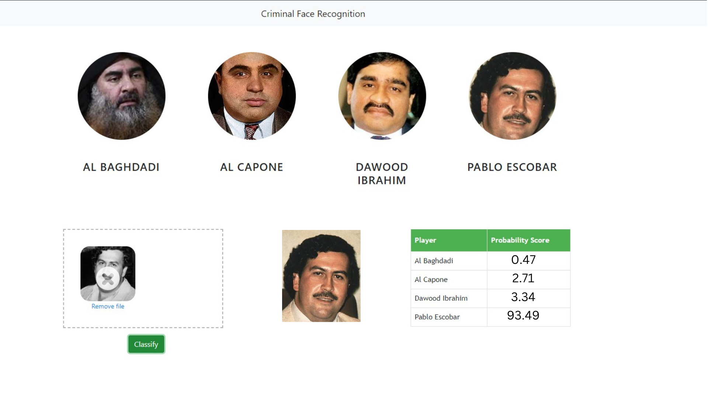

In this data science and machine learning project, we classify criminals. We restrict classification to only 4 criminals,
1) Pablo Escobar
2) Dawood Ibrahim
3) Al Capone
4) Al Baghdadi

Here is the folder structure:
* UI : This contains ui website code 
* server: Python flask server
* model: Contains python notebook for model building
* images_dataset: Dataset used for our model training

Technologies used in this project:
1. Image downloader - Imageeye extension for data collection
2. Python
3. Numpy and OpenCV for data cleaning
4. Matplotlib & Seaborn for data visualization
5. Sklearn for model building
6. Visual studio code as IDE
7. Python flask for http server
8. HTML/CSS/Javascript for UI
